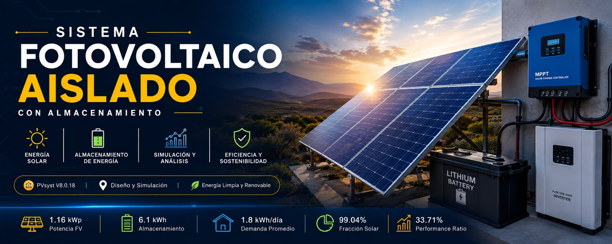
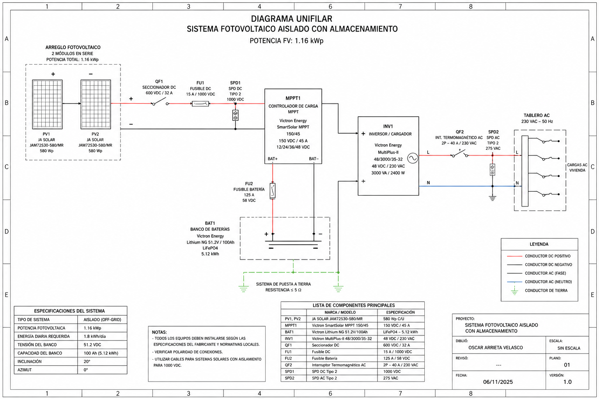

  

☀️ SISTEMA FOTOVOLTAICO AISLADO CON ALMACENAMIENTO

###  Diseño • Simulación • Almacenamiento • Análisis Energético

📌 Descripción

Diseño y simulación de un sistema fotovoltaico aislado con almacenamiento de energía, desarrollado mediante PVsyst.

El proyecto contempla el dimensionamiento del campo fotovoltaico, configuración del sistema de almacenamiento, análisis de la demanda energética, evaluación de pérdidas y simulación del comportamiento energético del sistema.

El diseño eléctrico fue complementado mediante diagramas unifilares desarrollados en AutoCAD, considerando la interconexión de los módulos fotovoltaicos, sistema de almacenamiento, inversor, protecciones eléctricas y tablero de distribución.

⚙️ Características principales

- Diseño de sistema fotovoltaico aislado.
- Simulación energética mediante PVsyst.
- Configuración de módulos fotovoltaicos y strings.
- Sistema de almacenamiento mediante baterías.
- Análisis de demanda y consumo energético.
- Evaluación de pérdidas del sistema.
- Análisis de energía generada, utilizada y faltante.
- Cálculo del Performance Ratio (PR).
- Diseño de diagramas unifilares en AutoCAD.
- Integración de protecciones eléctricas DC y AC.

# 📸 Galería

### Diagrama unifilar general del sistema fotovoltaico.
Representación eléctrica de la conexión entre módulos FV, inversor, protecciones y tablero de distribución, realizado en AUTOCAD. 

☀️ Arreglo Fotovoltaico

El sistema está compuesto por 2 módulos fotovoltaicos de 580 Wp conectados en serie, obteniendo una potencia instalada de 1.16 kWp.

                 ☀️ RADIACIÓN SOLAR
                         │
                         ▼
                ┌─────────────────┐
                │    PV1 580 Wp   │
                └────────┬────────┘
                         │
                       SERIE
                         │
                ┌────────▼────────┐
                │    PV2 580 Wp   │
                └────────┬────────┘
                         │
                         ▼
                ┌─────────────────┐
                │  PROTECCIÓN DC  │
                └────────┬────────┘
                         │
                         ▼
                ┌─────────────────┐
                │      MPPT       │
                └────────┬────────┘
                         │
                  ┌──────┴──────┐
                  │             │
                  ▼             ▼
           ┌────────────┐ ┌────────────┐
           │  BATERÍA   │ │  INVERSOR  │
           │   6.1 kWh  │ │            │
           └─────┬──────┘ └──────┬─────┘
                 │               │
                 └───────┬───────┘
                         ▼
                 ┌──────────────┐
                 │   TABLERO AC │
                 └──────┬───────┘
                        │
                        ▼
                     🏠 CARGAS

Potencia instalada

580 Wp × 2 módulos = 1160 Wp
Potencia FV = 1.16 kWp

🔋 Sistema de Almacenamiento

El modelo original utiliza una batería de tecnología Lithium-ion NCA.

Características

Tensión nominal:      50 V
Capacidad:            134 Ah
Energía almacenada:   6.1 kWh
SOC mínimo:           10 %

La batería permite almacenar energía generada por el arreglo fotovoltaico y suministrarla posteriormente a las cargas.

🏠 Demanda Energética

Carga	Potencia	Uso
Lámparas	25 W	0.5 h/día
TV / PC / móvil	100 W	0.5 h/día
Electrodomésticos	250 W	0.5 h/día
Lavaplatos / lavadora	1200 W	Según perfil
Consumos en espera	—	Permanente

Consumo diario

Demanda promedio ≈ 1.8 kWh/día
Demanda configurada = 1812 Wh/día

🔌 Arquitectura del Sistema

                         ☀️
                  RADIACIÓN SOLAR
                         │
                         ▼
              ┌────────────────────┐
              │   ARRAY FV 1.16kWp │
              │    2 × 580 Wp      │
              └──────────┬─────────┘
                         │
                         ▼
              ┌────────────────────┐
              │ PROTECCIONES DC    │
              └──────────┬─────────┘
                         │
                         ▼
              ┌────────────────────┐
              │       MPPT         │
              └──────────┬─────────┘
                         │
              ┌──────────┴──────────┐
              │                     │
              ▼                     ▼
       ┌──────────────┐      ┌──────────────┐
       │    BATERÍA   │      │   INVERSOR   │
       │    6.1 kWh   │      │              │
       └──────┬───────┘      └──────┬───────┘
              │                     │
              │                     ▼
              │             ┌──────────────┐
              │             │ PROTECCIÓN AC│
              │             └──────┬───────┘
              │                    │
              └──────────┬─────────┘
                         ▼
                ┌─────────────────┐
                │   TABLERO AC    │
                └────────┬────────┘
                         │
                         ▼
                      🏠 CARGAS

## 📊 Simulación Energética

La simulación fue realizada mediante PVsyst para evaluar el comportamiento energético del sistema durante un periodo anual.
Se analizaron los principales indicadores de desempeño, incluyendo producción fotovoltaica, energía suministrada a las cargas, pérdidas del sistema, energía faltante, excedentes y Performance Ratio.
Resultados anuales
Indicador	Resultado
Energía solar disponible	1656.36 kWh/año
Energía útil solar	654.94 kWh/año
Energía faltante	6.23 kWh/año
Energía excedente	961.46 kWh/año
Fracción solar	99.04 %
Performance Ratio	33.71 %

📈 Balance Energético

                    ENERGÍA SOLAR
                          │
                          ▼
                  1656.36 kWh/año
                          │
               ┌──────────┴──────────┐
               │                     │
               ▼                     ▼
        ENERGÍA ÚTIL              EXCEDENTE
        654.94 kWh                961.46 kWh
               │
               ▼
             CARGAS

El sistema presenta una fracción solar de 99.04 %, mientras que se registra una energía faltante anual de 6.23 kWh.

Una cantidad significativa de la energía disponible permanece sin utilizar debido principalmente a periodos en los que la batería alcanza su capacidad de almacenamiento.

📅 Comportamiento Mensual

Mes	Energía faltante
Enero	2.60 kWh
Febrero	0 kWh
Marzo	0 kWh
Abril	0 kWh
Mayo	0 kWh
Junio	0 kWh
Julio	0 kWh
Agosto	0 kWh
Septiembre	0 kWh
Octubre	0 kWh
Noviembre	0 kWh
Diciembre	3.63 kWh
TOTAL	6.23 kWh

📉 Análisis de Pérdidas

El análisis realizado mediante PVsyst permitió identificar las pérdidas presentes durante las diferentes etapas del sistema.

                IRRADIACIÓN SOLAR
                       │
                       ▼
             ┌──────────────────┐
             │ Irradiación      │
             └────────┬─────────┘
                      │
                      ▼
             ┌──────────────────┐
             │ Pérdidas IAM     │
             └────────┬─────────┘
                      │
                      ▼
             ┌──────────────────┐
             │ Conversión FV    │
             └────────┬─────────┘
                      │
                      ▼
             ┌──────────────────┐
             │ Pérdidas térmicas│
             └────────┬─────────┘
                      │
                      ▼
             ┌──────────────────┐
             │ Cableado DC      │
             └────────┬─────────┘
                      │
                      ▼
             ┌──────────────────┐
             │ Controlador MPPT │
             └────────┬─────────┘
                      │
                      ▼
             ┌──────────────────┐
             │ Almacenamiento   │
             └────────┬─────────┘
                      │
                      ▼
             ┌──────────────────┐
             │ Inversor         │
             └────────┬─────────┘
                      │
                      ▼
                    CARGAS

Principales pérdidas identificadas

* Pérdidas por nivel de irradiancia.
* Pérdidas por temperatura.
* Pérdidas por calidad de módulos.
* Pérdidas por mismatch.
* Pérdidas óhmicas del cableado.
* Pérdidas del convertidor.
* Pérdidas asociadas al almacenamiento.
* Energía no utilizada por batería completamente cargada.

🧰 Componentes

☀️ Módulos Fotovoltaicos

JA Solar JAM72S30-580/LR

Potencia individual: 580 Wp
Cantidad: 2
Potencia total: 1.16 kWp

⚡ Controlador MPPT

Victron SmartSolar MPPT 150/45

Voltaje FV máximo: 150 V
Corriente máxima: 45 A
Potencia FV a 48 V: 2600 W
Eficiencia máxima: 98 %

🔋 Batería

Victron Lithium NG 51.2 V / 100 Ah

Tensión: 51.2 V
Capacidad: 100 Ah
Energía: 5.12 kWh

🔌 Inversor/Cargador

Victron MultiPlus-II 48/3000/35-32

Tensión DC: 38–66 V
Salida: 230 VAC
Potencia: 3000 VA
Potencia continua: 2400 W
Potencia pico: 5500 W

🛡️ Protecciones Eléctricas

El diseño conceptual considera:

* Seccionador DC
* Fusibles gPV
* Fusible de batería
* SPD DC Tipo 2
* SPD AC Tipo 2
* Interruptor termomagnético AC
* Puesta a tierra
* Tablero de distribución

La selección definitiva de protecciones debe realizarse considerando los valores reales de tensión, corriente, conductores y capacidad de interrupción.

📂 Estructura del Repositorio

📁 SISTEMA-FOTOVOLTAICO-AISLADO
│
├── 📄 README.md
│
├── 📁 01_Diagrama_Unifilar
│   └── 🖼️ diagrama_unifilar.png
│
├── 📁 02_PVsyst
│   └── 📄 Reporte_PVsyst.pdf
│
├── 📁 03_Memoria_Tecnica
│   └── 📄 Memoria_Tecnica.pdf
│
├── 📁 04_Calculos
│   ├── 📊 calculo_generacion.xlsx
│   ├── 📊 calculo_consumo.xlsx
│   └── 📊 calculo_bateria.xlsx
│
├── 📁 05_Fichas_Tecnicas
│   ├── 📄 Modulos_FV.pdf
│   ├── 📄 Controlador_MPPT.pdf
│   ├── 📄 Bateria.pdf
│   └── 📄 Inversor.pdf
│
└── 📁 06_Imagenes
    ├── 🖼️ pvsyst_01.png
    ├── 🖼️ pvsyst_02.png
    └── 🖼️ sistema_fotovoltaico.png

⸻

🎯 Objetivos del Proyecto

* Diseñar un sistema fotovoltaico aislado.
* Determinar la potencia fotovoltaica instalada.
* Caracterizar la demanda energética.
* Evaluar el almacenamiento energético.
* Simular el comportamiento anual mediante PVsyst.
* Analizar las pérdidas del sistema.
* Evaluar la fracción solar.
* Determinar energía excedente y faltante.
* Analizar el desempeño energético.
* Documentar técnicamente el proyecto.

⸻

## 🧰 Software y Herramientas

- PVsyst — Diseño y simulación de sistemas fotovoltaicos.
- AutoCAD — Elaboración de diagramas unifilares y diseño eléctrico.
- Análisis energético — Evaluación de generación, demanda, pérdidas y almacenamiento.

⸻

## 🎯 Conclusión

Este proyecto permitió integrar el diseño, simulación y análisis energético de un sistema fotovoltaico aislado con almacenamiento, complementándolo con el desarrollo de diagramas eléctricos en AutoCAD.

El resultado representa una aplicación práctica de herramientas de diseño fotovoltaico, análisis energético y documentación eléctrica utilizadas en proyectos de ingeniería.

👨‍💻 Autor

Oscar Arrieta Velasco

Ingeniería en Sistemas Energéticos y Redes Inteligentes

Instituto Politécnico Nacional — IPN

Áreas de interés

⚡ Sistemas Energéticos
☀️ Energías Renovables
🔋 Almacenamiento Energético
🤖 Automatización
💻 Simulación
📊 Análisis de Datos

⸻

☀️ ENERGÍA RENOVABLE + INGENIERÍA + SIMULACIÓN

Diseño • Modelado • Análisis • Optimización

© 2026 Oscar Arrieta Velasco

